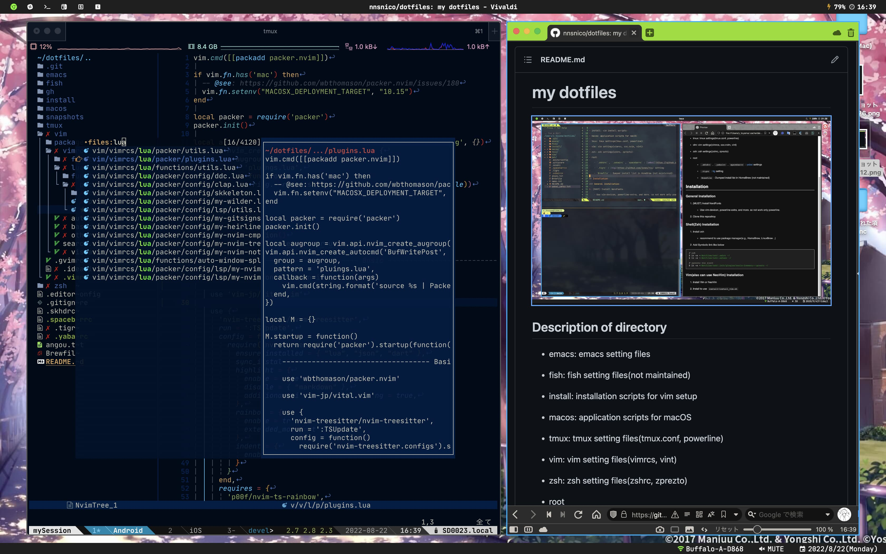

# my dotfiles



## Description of directory

- dict: merged dictionary file for SKK

- emacs: emacs setting files

- fish: fish setting files(not maintained)

- gh: config file for [GitHhub CLI](https://github.com/cli/cli)

- install: installation scripts for vim setup

- macos: application scripts for macOS

- tmux: tmux setting files(tmux.conf, powerline)

- vim: vim setting files(vimrcs)

- zsh: zsh setting files(zshrc, zprezto)

- root
  - `.skhdrc` , `.yabairc` , `spacebarrc` : [yabai](https://github.com/koekeishiya/yabai) settings
  - `.tigrc` : [tig](https://github.com/jonas/tig) setting

## Requirements

- [NerdFonts](https://github.com/ryanoasis/nerd-fonts) (to use for NeoVim)
- Python
  - Use for [Powerline](https://github.com/powerline/powerline). To install, please see [here](https://powerline.readthedocs.io/en/latest/installation.html#generic-requirements)

## Setup

### Setup Zsh

1. Install zsh
    - recommend to use package manager(e.g., HomeBrew, LinuxBrew ..)

1. Add Symbolic link like below
    ```bash
    # zsh
    $ ln -s ~/dotfiles/zsh/.zshrc ~/
    $ ln -s ~/dotfiles/zsh/.zshenv ~/

    # zprezto via zinit
    $ ln -s ~/dotfiles/zsh/.zinit/plugins/sorin-ionescu---prezto ~/
    ```

### Setup NeoVim

1. Install NeoVim nightly (it will be installed from zinit !)
    - (Optional) To support all plugins, you should also install the following:
        - Node.js >= 12.12
        - Python >= 3
        - Deno (used in [skkeleton](https://github.com/vim-skk/skkeleton))

1. Install to use `install/install_vim.sh`

### Setup tmux

1. Install [tmux](https://github.com/tmux/tmux)

1.
    ```bash
    $ pip install powerline-status
    ```

1.
    ```bash
    $ cp -r $(pip show powerline-status | grep Location | awk '{print $2}')/powerline/config_files ~/.config/powerline
    ```

1. Add symbolic link
    - config file
      ```bash
      $ ln -s ~/dotfiles/tmux/.tmux.conf ~/
      ```
    - powerline top theme file
      1. Windows(WSL2)
          ```bash
          $ ln -sf ~/dotfiles/tmux/powerline.json ~/.config/powerline/themes/
          ```
      1. MacOS
          ```bash
          $ ln -sf ~/dotfiles/tmux/powerline_terminus.json ~/.config/powerline/themes/
          ```
    - powerline theme file
      ```bash
      $ ln -sf ~/dotfiles/tmux/default.json ~/.config/powerline/themes/tmux/default.json
      ```

<!--
vim: ts=2 sts=2 sw=2 et :
-->
