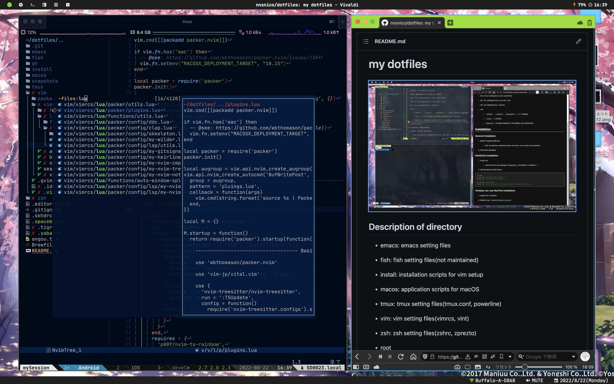

# my dotfiles



## Description of directory

- emacs: emacs setting files

- fish: fish setting files(not maintained)

- install: installation scripts for vim setup

- macos: application scripts for macOS

- tmux: tmux setting files(tmux.conf, powerline)

- vim: vim setting files(vimrcs, coc.nvim, vint)

- zsh: zsh setting files(zshrc, zprezto)

- root

  - `.skhdrc` , `.yabairc` , `spacebarrc` : [yabai](https://github.com/koekeishiya/yabai) settings

  - `.tigrc` : [tig](https://github.com/jonas/tig) setting

  - `Brewfile` : Dumped install list in HomeBrew (not maintained)

## Requirements

- [NerdFonts](https://github.com/ryanoasis/nerd-fonts) (to use for NeoVim)
- Python
  - Use for [Powerline](https://github.com/powerline/powerline). To install, please see [here](https://powerline.readthedocs.io/en/latest/installation.html#generic-requirements).

## Setup

### Setup Zsh

1. Install zsh
    - recommend to use package manager(e.g., HomeBrew, LinuxBrew ..)

1. Add Symbolic link like below

```
# zsh
$ ln -s ~/dotfiles/zsh/.zshrc ~/
$ ln -s ~/dotfiles/zsh/.zshenv ~/

# zprezto via zinit
$ ln -s ~/dotfiles/zsh/.zinit/plugins/sorin-ionescu---prezto ~/
```

### Setup NeoVim

1. Install NeoVim >= 0.5.0
    1. (Optional) To support all plugins, you should also install the following:
        - Node.js >= 12.12
        - Python >= 3
        - [SKK dictionary](https://skk-dev.github.io/dict/)
            - Deno (use [skkeleton](https://github.com/vim-skk/skkeleton))

1. Install to use `install/install_vim.sh`

### Setup tmux

1. Install [tmux](https://github.com/tmux/tmux)

1. `pip install powerline-status`

1. `cp -r $(pip show powerline-status | grep Location | awk '{print $2}')/powerline/config_files ~/.config/powerline`

1. Add symbolic link

    1. `ln -s ~/dotfiles/tmux/.tmux.conf`

    1. (Windows(WSL2)) `ln -s ~/.config/powerline/themes/powerline.json ~/dotfiles/tmux/powerline.json`

    1. (MacOS) `ln -s ~/.config/powerline/themes/powerline.json ~/dotfiles/tmux/powerline_terminus.json`

<!--
vim: ts=2 sts=2 sw=2 et :
-->
